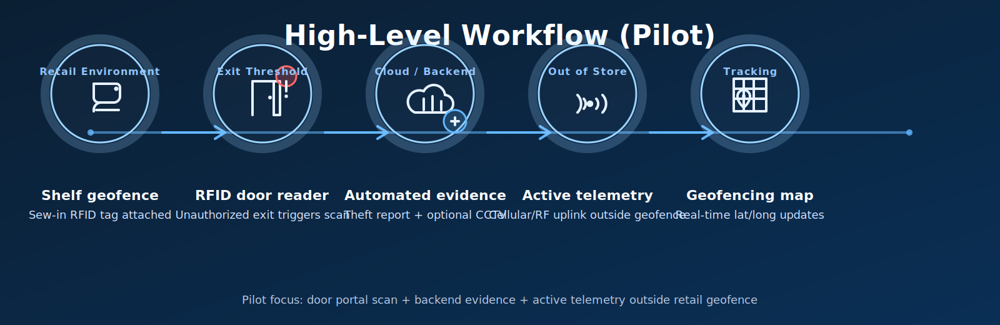

# SYSTEM REQUIREMENTS & PRODUCT DESIGN SPECIFICATION (PDS)
**Document Ref:** Safeon-Oxman-SFT-001  
**Project:** Hybrid RFID Reader‑Tag & Telemetry Platform (Pilot Deployment Phase)  
**Author:** Pharrell Mwewa Chatupa, CTO, Shenzhen Safeon Technology Co., Ltd.  
**Client:** Des Fynn, Director, Oxman Group Pty Ltd (DES TRACK)  
**Date:** June 2, 2026  
**Status:** Engineering Review / Working Draft  

---

## 1. Executive Summary & Purpose
This document establishes the technical specifications, hardware architecture, and firmware state requirements for the **pilot deployment** of the hybrid RFID Reader‑Tag ecosystem.

The immediate engineering sprint focuses on developing a **20‑unit prototype run** to validate real‑world cellular/RF telemetry, anti‑theft workflows, and long‑range asset tracking outside a laboratory environment.

---

## 2. System Architecture & High‑Level Workflow
The platform bridges short‑range retail asset tagging with long‑range tracking, behaving simultaneously as an **asset tag** and an **infrastructure reader**.

### 2.1 High‑Level Flow

> Note: The pilot diagrams for “theft event visualization” and the “power state machine” will be added once the final images are exported to `docs_src/assets/`.

### 2.2 Functional Narrative
- **In‑store theft detection**: High‑value assets are fitted with Des’s designated sew‑in RFID tags. If an asset passes the exit threshold without point‑of‑sale clearance, a localized RFID portal scans the asset tag and updates the backend system to **Stolen** status.
- **Automated evidence generation**: The cloud platform compiles a digital incident report. If integrated with store camera layouts, it attaches a video/still snapshot tracing the object from shelf to door.
- **External telemetry**: Once the asset exits the retail geofence, the onboard tracking architecture provides remote location updates outside store premises.

---

## 3. Hardware Engineering Specifications

### 3.1 Mechanical Enclosure & Form Factor (Pilot Adjustments)
**Production target (long‑term):**
- Pocket‑sized compact profile: **40 × 25 × 10 mm** (target envelope)

**Pilot trial adjustment (20‑unit run):**
- Modified slightly thicker enclosure to increase mechanical tolerance for:
  - physical debugging
  - manual assembly testing
  - optimal antenna placement during field testing

**Tag attachment mechanism (pilot):**
- Temporary structural eyelet/loop to support a secure loop strap/cord for quick attach/remove during testing.
- This runs in parallel with future development of a proprietary mechanical/magnetic POS release base.

### 3.3 Hardware Extensibility & Sensor Payload
The core PCB layout must include:
- Unpopulated pads and modular expansion rails (I2C/SPI) to allow fast integration of secondary telemetry peripherals.

**Primary phase (pilot):**
- Base tracking and RF telemetry.

**Secondary expansion phase (future):**
- Direct integration of onboard accelerometers/motion detectors and temperature sensors without requiring a fundamental PCB re‑spin.

---

## 4. Firmware & Power Management Architecture
To transition successfully to extended commercial lifespan requirements, the firmware must implement a strictly managed state machine.

### 4.1 Power State Machine
*(Diagram pending – export to `docs_src/assets/state-machine.(png|svg)` and link here.)*

### 4.2 State Definitions
**State 0 — Deep Sleep / Dormant (Shelf Life)**
- **Objective:** Achieve up to a 2‑year dormant shelf life prior to deployment.
- **Logic:** All non‑essential peripherals and RF engines are placed into hard sleep. The MCU wakes on an internal timer to broadcast a minimal “turn‑on beacon” at a wide interval, then returns to sleep.

**State 1 — Active Telemetry Mode**
- **Objective:** Minimum 6 months operational life in the field.
- **Logic:** Triggered by threshold breach or remote activation. Power cycling across modems + motion wake used to reduce current draw.

**State 2 — Standby / Reset**
- Baseline monitoring + accelerometer wake‑on‑motion armed.

---

## 5. Software & Backend Integration Requirements

### 5.1 API Run‑Sheets & Documentation Format
- All system documentation, endpoint definitions, and payload structures must be formatted in clean, descriptive Markdown for running‑sheet workflows and AI review/iteration.

### 5.2 Platform Scalability
- Decouple telemetry processing from business logic to support Asset Management + Event Management dashboards over time.

---

## 6. Pilot Timeline & Deliverables

### 6.1 Immediate Milestone Deliverables
**Target delivery:** 20 fully functional prototype tracking units.

**In‑person alignment milestone:** June 20, 2026
- Physical hardware review
- Firmware state verification
- Mechanical assembly optimization at Oxman facility

**Pilot objective:** Enable stakeholders to validate cellular handoffs and out‑of‑store localization in real environments.

---

## 7. Open Items / TBDs (Engineering Review)

### 7.1 Hardware
- RFID reader module: exact model / supplier / interface (SPI/UART) for pilot
- Cellular module: exact model / bands / power profile
- Antenna strategy: internal vs external, tuning plan, test fixtures
- Target enclosure thickness for pilot and max allowed PCB area
- Environmental rating target (IP rating) for pilot (if any)

### 7.2 Firmware
- Turn‑on beacon interval in State 0 (and battery impact model)
- Motion thresholds / sampling strategy in State 1 and State 2
- Remote command security (auth, replay protection, key management)
- Remote kill command / POS disarm exact UX + permission model

### 7.3 Backend
- CCTV integration scope: inputs required (camera map, timestamps), supported systems
- Theft report format and jurisdiction customization requirements
- API payload schemas and versioning strategy (v1/v2), telemetry ingestion contracts

